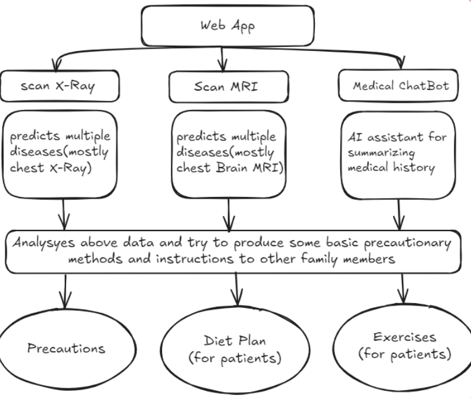

# HealthSense AI

**HealthSense AI** is an AI-powered healthcare solution designed to enable **early disease detection** in remote and underserved areas. It allows users to upload medical images (such as X-rays and MRIs) through a **Flutter-based Android application**, which are then processed by a **Flask backend** with AI/ML models for **disease diagnosis**.

[](https://www.canva.com/design/DAGe569Er38/YcruucpDrXc7OK4aNJjafQ/edit?utm_content=DAGe569Er38&utm_campaign=designshare&utm_medium=link2&utm_source=sharebutton)  
[]()

## Demo Video

<video width="300" controls>
  <source src="assets/videos/demo_video.mp4" type="video/mp4">
  Your browser does not support the video tag.
</video>

https://github.com/user-attachments/assets/335b0d8e-d5db-466f-ba0e-1e73c9fc4eb4

[](https://github.com/user-attachments/assets/335b0d8e-d5db-466f-ba0e-1e73c9fc4eb4)
[](assets/videos/demo_video.mp4)

## 📌 Features

✅ AI-powered disease detection (e.g., Pneumonia, Alzheimer’s)  
✅ Secure and user-friendly Flutter-based mobile app  
✅ Medical chatbot for instant health-related assistance  
✅ Rapid diagnosis through deep learning models

## 🏗 Tech Stack

- **Frontend:** Flutter (Dart)
- **Backend:** Flask (Python)
- **AI/ML Models:** TensorFlow, Hugging Face, Deep Learning
- **Models Used:**
  - BioGPT (Medical chatbot)
  - Vision Transformer (MRI scans analysis)
  - CheXNet (Chest X-ray classification)

## 📷 Project Workflow

1. **Upload** an X-ray or MRI image in the mobile app
2. **Flask backend** processes the image using AI models
3. **AI Prediction** is generated and displayed in the app
4. **Medical chatbot** provides health advice



## 📜 Presentation & Demo

📄 [Project Presentation and Prototype Video (PDF)](https://drive.google.com/drive/folders/1AuBBcBQzRescKymIEuNJIkcW2fb-8o5g?usp=drive_link)
📄 [Canva)](https://www.canva.com/design/DAGe569Er38/YcruucpDrXc7OK4aNJjafQ/edit?utm_content=DAGe569Er38&utm_campaign=designshare&utm_medium=link2&utm_source=sharebutton)

## 🛠 Project Structure

```
HealthSense-AI/
├── lib/
│   ├── handlers/
│   │   ├── imagePickerHandler.dart     # X-ray image processing
│   │   └── imagePickerHandlerMRI.dart  # MRI image processing
│   ├── screens/
│   │   ├── ResultMRIScreen.dart        # MRI results display
│   │   ├── ResultXrayScreen.dart       # X-ray results display
│   │   └── ...
│   └── main.dart                       # App entry point
├── server/
│   └── main.py                         # Flask backend with AI models
└── pubspec.yaml                        # Flutter dependencies
```

## ⚙️ Prerequisites

Before running the application, ensure you have the following installed:

- Flutter SDK (>= 3.5.0)
- Python 3.x
- Required Python packages:
  - Flask
  - transformers
  - torch
  - torchvision
  - PIL
  - werkzeug

## 🚀 Installation & Setup

1. **Clone the Repository**

   ```bash
   git clone https://github.com/yourusername/HealthSense-AI.git
   cd HealthSense-AI
   ```

2. **Install Flutter Dependencies**

   ```bash
   flutter pub get
   ```

3. **Set up Python Environment**

   ```bash
   cd server
   pip install -r requirements.txt
   ```

4. **Start the Backend Server**

   ```bash
   python main.py
   ```

5. **Run the Flutter App**
   ```bash
   flutter run
   ```
